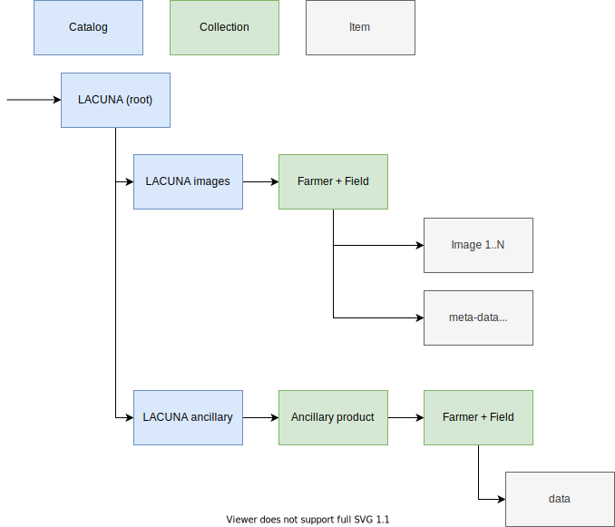

# Eyes on the ground: Providing quality model training data through smartphone images of crops

Processing code to create a unique dataset of at least 35,000 timestamped georeferenced crop images, along with various labels on input use, crop management, phenology, crop damage and yields.

This data will have valuable contributions in applications such as crop modeling, agricultural finance and insurance, agricultural advisories, and early warning systems. 

### Introduction

This codebase serves two purposes, first provide a method to let data providers quickly screen for privacy issues of images collected in the field. Second, provide ancillary data with these images to support remote sensing applications.

### Privacy screening

Crop images are collected by farmers in support of insurance practices and crop monitoring. However, oversight, inexperience with digital technology can lead to situations where people's private property or recognizable faces are present within a dataset which will be distributed widely and openly. This presents a clear privacy issue in violation with IRB requirements. Historically, manual screening was applied. However, with growing field trials this is not a long term solution. As such, an automated filter should relieve some of the burden.

Here, we use existing deep learning models to screen crops for non-vegetation images and human faces. Data allows for the screening of a single image or a whole directory of images (recursively parsed) with results returne as a CSV file for post-processing.

In our setup we use two common models to label both vegetation and faces. For the former we use a keras implementation of the PLACES365 VGG model, for the latter we use the MTCNN face recognition library.

The provided solution does not offer a retrained model specific to the circumstances of the field trials in order to scale flexibly. A trained model would be specific to a given field trial. Where accuracy might be higher, it would be less widely deployable compared to the unaltered model.

The output, which lists both the accuracy (%) and the original labels allows for post-processing and manual screening to remove remaining mislabelled images (and either classify them as either a privacy issue or not).

### Ancillary data remote sensing data

A second part of the processing requires amending seasonal image with ancillary remote sensing data. Remote sensing data will be stripped of geographic location data to provide anonymous but meaning full data for remote sensing analysis in conjunction with the original field based images. Data will be formatted as [STAC compliant](https://stacspec.org/).

Downloads of ancillary data are done using python code which taps into the Google Earth Engine back end. You can install the required package using `pip3 install gee-subset`. Check other requirements in the requirements.txt file as well. The code will run for specific locations and date ranges to be set manually. Final output will strip the data from spatial identifiers and list the pixel data (if there are multiple returns from top-left to bottom-right row wise).

### STAC processing

The above data is then compiled into a STAC catalogue, with the following structure. The focus here is on the image data, keeping the remote sensing data separate. The remote sensing data can however easily be merged to provide a consistent (machine learning) dataset. Note that no interpolation is done on the data products to retain the original data as much as possible. The latter is up to the user as many different interpolation strategies exist.

## Data sources

Polygons of villages were provided by the World Resource Insitute. Only labels are used and the original data needs to be downloaded from this location:

https://datasets.wri.org/dataset/district-administrative-boundaries-of-kenya

or sourced from the data directory of this project.

## Acknowledgements

This project is a collaboration between ACRE, IFPRI, CGIAR Big Data, and the Lacuna Fund.

### References

- Places: A 10 million Image Database for Scene Recognition
B. Zhou, A. Lapedriza, A. Khosla, A. Oliva, and A. Torralba (2017).
IEEE Transactions on Pattern Analysis and Machine Intelligence

- Joint face detection and alignment using multitask cascaded convolutional networks. Zhang, K., Zhang, Z., Li, Z., and Qiao, Y. (2016). IEEE Signal Processing Letters, 23(10):1499–1503.

